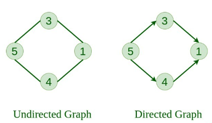
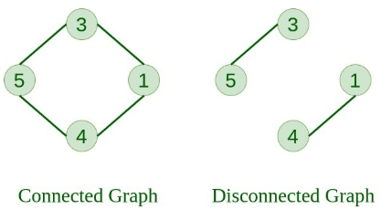

# What is Graph?
Graph is a non-linear data structure consisting of vertices and edges. The vertices are sometimes also referred to as nodes and the edges are lines or arcs that connect any two nodes in the graph. More formally a Graph is composed of a set of vertices( V ) and a set of edges( E ). The graph is denoted by G(V, E).

## The basic properties of a graph include:
1. Vertices (nodes): The points where edges meet in a graph are known as vertices or nodes. A vertex can represent a physical object, concept, or abstract entity.

2. Edges: The connections between vertices are known as edges. They can be undirected (bidirectional) or directed (unidirectional).

3. Weight: A weight can be assigned to an edge, representing the cost or distance between two vertices. A weighted graph is a graph where the edges have weights.

4. Degree: The degree of a vertex is the number of edges that connect to it. In a directed graph, the in-degree of a vertex is the number of edges that point to it, and the out-degree is the number of edges that start from it.

5. Path: A path is a sequence of vertices that are connected by edges. A simple path does not contain any repeated vertices or edges.

6. Cycle: A cycle is a path that starts and ends at the same vertex. A simple cycle does not contain any repeated vertices or edges.

# Types Of Graphs

## 1. Null Graph
A graph is known as a null graph if there are no edges in the graph.

## 2. Trivial Graph
Graph having only a single vertex, it is also the smallest graph possible.

## 3. Undirected Graph
A graph in which edges do not have any direction. That is the nodes are unordered pairs in the definition of every edge. 

## 4. Directed Graph
A graph in which edge has direction. That is the nodes are ordered pairs in the definition of every edge.

## 5. Connected Graph
The graph in which from one node we can visit any other node in the graph is known as a connected graph. 

## 6. Disconnected Graph
The graph in which at least one node is not reachable from a node is known as a disconnected graph.

## 7. Regular Graph
The graph in which the degree of every vertex is equal to K is called K regular graph.

## 8. Complete Graph
The graph in which from each node there is an edge to each other node.

## 9. Cycle Graph
The graph in which the graph is a cycle in itself, the minimum value of degree of each vertex is 2.

## 10. Cyclic Graph
A graph containing at least one cycle is known as a Cyclic graph.

## 11. Directed Acyclic Graph
A Directed Graph that does not contain any cycle. 

## 12. Bipartite Graph
A graph in which vertex can be divided into two sets such that vertex in each set does not contain any edge between them.

## 13. Weighted Graph
* A graph in which the edges are already specified with suitable weight is known as a weighted graph. 
* Weighted graphs can be further classified as directed weighted graphs and undirected weighted graphs.

## 14. Trees
A connected graph with no cycles.

## 15. Sparse Graphs
A graph with relatively few edges compared to the number of vertices.

## 16. Pseudo Graph
A graph G with a self-loop and some multiple edges is called a pseudo graph. A pseudograph is a type of graph that allows for the existence of self-loops (edges that connect a vertex to itself) and multiple edges (more than one edge connecting two vertices). In contrast, a simple graph is a graph that does not allow for loops or multiple edges.

## 17. Euler Graph
If all the vertices of any connected graph have an even degree, then this type of graph will be known as the Euler graph.

## 18. Hamiltonian Graph
The graph will be known as a Hamiltonian graph if there is a closed walk in a connected graph, which passes each and every vertex of the graph exactly once except the root vertex or starting vertex. The Hamiltonian walk must not repeat any edge.

* In the below graph, there is a closed walk ABCDEFA.
* Except for the starting vertex, it passed through every vertex of the graph exactly once.

