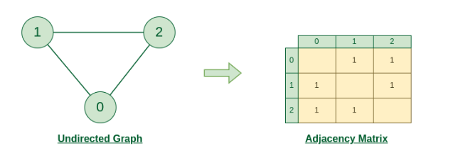
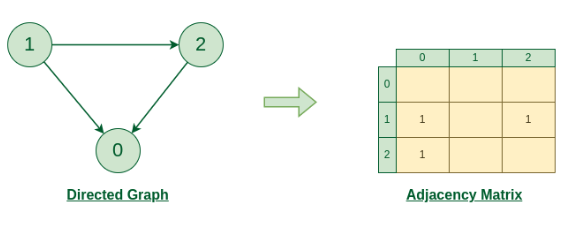
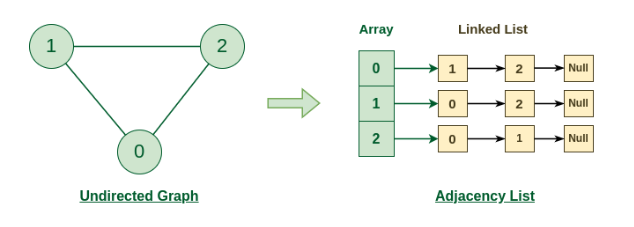
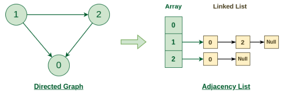

# Representations of Graph

Here are the two most common ways to represent a graph
1. Adjacency Matrix
2. Adjacency List

# Adjacency Matrix

An adjacency matrix is a way of representing a graph as a matrix of boolean (0’s and 1’s).

Let’s assume there are n vertices in the graph So, create a 2D matrix adjMat[n][n] having dimension n x n.
* If there is an edge from vertex i to j, mark adjMat[i][j] as 1. 
* If there is no edge from vertex i to j, mark adjMat[i][j] as 0.

Code: [AdjacencyMatrix.cpp](../AdjacencyMatrix.cpp)

# Adjacency List
An array of Lists is used to store edges between two vertices. The size of array is equal to the number of vertices (i.e, n). Each index in this array represents a specific vertex in the graph. The entry at the index i of the array contains a linked list containing the vertices that are adjacent to vertex i.

Let’s assume there are n vertices in the graph So, create an array of list of size n as adjList[n].
* adjList[0] will have all the nodes which are connected (neighbour) to vertex 0.
* adjList[1] will have all the nodes which are connected (neighbour) to vertex 1 and so on.

Code: [AdjacencyListImpl.cpp](../AdjacencyListImpl.cpp)

