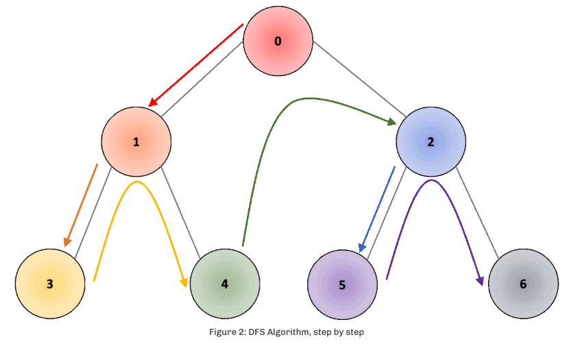
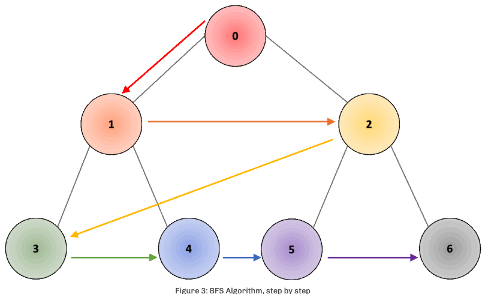

# Graph Traversal Algorithms – Overview
When traversing all the nodes through a graph, regardless of the algorithm used, we can face the following issues:

1. There may be cases in which the graph is not connected, therefore not all nodes can be reached.
2. In the case of cyclic (starts and ends at the same node) graphs, we should make sure that cycles do not cause the algorithm to go into an infinite loop.
3. We may need to visit some nodes more than once, since we do not know if a node has already been seen, before transitioning to it.

Graph traversal algorithms can solve the second and third problems by flagging vertices as visited when appropriate: 
1. at first, no node is flagged as visited;
2. when the node is visited, we flag it as visited during the traversal; 
3. a flagged node is not visited a second time. This keeps the program from going into an infinite loop when it encounters a cycle.

# Depth First Search (DFS)
In this algorithm, we follow one path as far as it will go. The algorithm starts in an arbitrary node, called root node and explores as far as possible along each branch before backtracking.

The algorithm can also be applied to directed graphs. DFS is implemented with a recursive algorithm and its temporal complexity is O(E+V).

## How does it work CONCEPTUALLY?
The DFS algorithm starts at the root (top) node of a tree and goes as far as it can down a given branch (path), then backtracks until it finds an unexplored path, and then explores it. The algorithm does this until the entire graph has been explored.

In the example shown in Fig. 2, the root node would be node “0”; we traverse in depth through node “1”, followed by node “3”. Once we reach the node, we move one level up to node “1” and traverse through all other connected nodes, in this case, node “4”. Once we have covered all connected nodes, we move again one level up, to node “0” and traverse all other connected nodes, in this case, node “2”. As we traverse through deeper nodes, we traverse through nodes “5” and “6”, covering all connected nodes.

Code: [DFS.cpp](../DFS.cpp)

# Breadth First Search (BFS)
In the BFS algorithm, rather than proceeding recursively, we pull out the first element from the queue, check if it has a path, check if it is the destination node we are interested in and if not add all the children nodes to it. We look at all the nodes adjacent to one before moving on to the next level.

The algorithm can also be applied to directed graphs. The algorithm’s time complexity is O(E+V).

## How does it work CONCEPTUALLY?
The BFS algorithm starts by searching a start node, followed by its adjacent nodes, then all nodes that can be reached by a path from the start node containing two edges, three edges, and so on.

In the example below from Fig. 3, the root node would be node “0”; we traverse in width through node “1”, followed by node “2”. Once we have traversed through all nodes in the first depth level, we move to the second depth level, starting with node “3”, and moving through nodes “4”, “5”, and “6”.

Code: [BFS.cpp](../BFS.cpp)

# DFS vs. BFS
As discussed here, BFS is used to search nodes that are closer to the given source; while DFS is used instead in cases where the solution is away from the source.

When coming to practical examples, BFS is typically used to find the shortest distance between two nodes, such as routing for GPS navigation; while DFS is more suitable for e.g. game/puzzle problems: we make a decision, then explore all paths through this decision, and if this decision leads to a win situation, then we stop.