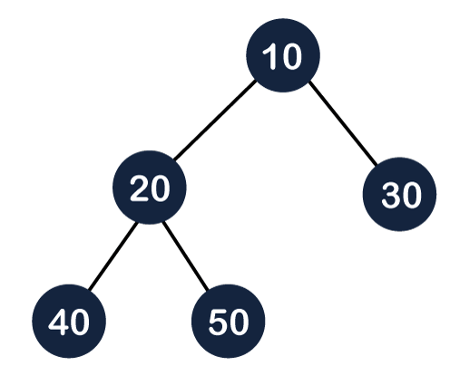
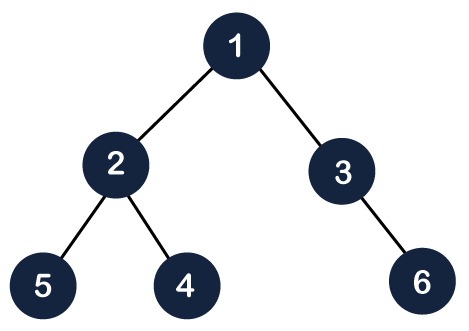
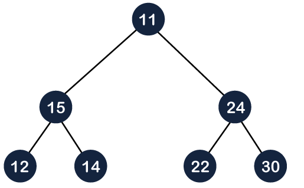
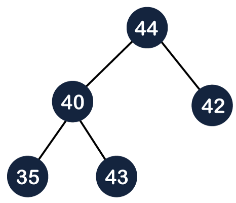

# Heap

A Heap is a complete binary tree data structure that satisfies the heap property: for every node, the value of its children is greater than or equal to its own value. Heaps are usually used to implement priority queues, where the smallest (or largest) element is always at the root of the tree.

## What is a Complete Binary Tree?
A complete binary tree is a special type of binary tree where all the levels of the tree are filled completely except the last level nodes which are filled from as left to right.

In the above figure, we can observe that all the internal nodes are completely filled except the leaf node; therefore, we can say that the above tree is a complete binary tree.

The above figure shows that all the internal nodes are completely filled except the leaf node, but the leaf nodes are added at the right part; therefore, the above tree is not a complete binary tree.

## Properties of Complete Binary Tree:
* A complete binary tree is said to be a proper binary tree where all leaves have the same depth.
* In a complete binary tree number of nodes at depth d is 2d. 
* In a  complete binary tree with n nodes height of the tree is log(n+1).
* All the levels except the last level are completely full.

## Operation allowed in Heap
1. Insert an element
2. Delete the element
    * We always delete/pop root element we can't randomly delete any element.
3. Get the max/min element in the heap depending on if it is a min/max heap.

## How can we arrange the nodes in the Tree?
### Min Heap
The value of the parent node should be less than or equal to either of its children.

### Max heap
The value of the parent node is greater than or equal to its children.

## How is Binary Heap represented? 
A Binary Heap is a Complete Binary Tree. A binary heap is typically represented as an array.

* The root element will be at Arr[0].
* The below table shows indices of other nodes for the ith node, i.e., Arr[i]:

| Value             | Description                        |
| ----------------- | ---------------------------------- |
| Arr[(i-1)/2]      | Returns the parent node            |
| Arr[(2*i)+1]      | Returns the left child node        |
| Arr[(2*i)+2]      | Returns the right child node       |
| Arr[floor(i/2)]   | Returns the parent of child node   |

## Insertion in Heap

Step 1: First increase the heap size by 1, so that it can store the new element.

Step 2: Insert the new element at the end of the Heap.

Step 3: This newly inserted element may distort the properties of Heap for its parents. So, in order to keep the properties of Heap, heapify this newly inserted element following a bottom-up approach.

Time Complexity: O(log(n)) (where n is no of elements in the heap)

## Deletion in Heap
Since deleting an element at any intermediary position in the heap can be costly, so we can simply replace the element to be deleted by the last element and delete the last element of the Heap. 

Step 1: Replace the root or element to be deleted by the last element.

Step 2: Delete the last element from the Heap.

Step 3: Since, the last element is now placed at the position of the root node. So, it may not follow the heap property. Therefore, heapify the last node placed at the position of root.

Time complexity: O(logn) where n is no of elements in the heap

## Heapify

Time Complexity: O(N)

Article: https://www.geeksforgeeks.org/building-heap-from-array/

Video: https://youtu.be/HqPJF2L5h9U?t=2532&si=Xfzz6B6v7a6NdfAP

## Problems:
